```text
Synapse/
├── 📄 Dockerfile
├── 📁 src/main/java/com/fiap/gs_synapse/
│   ├── 📁 controller/
│   │   ├── CompetenciaViewController.java
│   │   ├── HomeViewController.java
│   │   ├── RecomendacaoProfissionalViewController.java
│   │   ├── RecomendacaoSaudeViewController.java
│   │   ├── RecomendacaoViewController.java
│   │   ├── RegistroBemEstarViewController.java
│   │   └── UsuarioViewController.java
│   ├── 📁 model/            # Entidades
│   │   ├── Competencia.java
│   │   ├── Recomendacao.java
│   │   ├── RecomendacaoProfissional.java
│   │   ├── RecomendacaoSaude.java
│   │   ├── RegistroBemEstar.java
│   │   └── Usuario.java
│   ├── 📁 repository/
│   │   ├── CompetenciaRepository.java
│   │   ├── RecomendacaoProfissionalRepository.java
│   │   ├── RecomendacaoRepository.java
│   │   ├── RecomendacaoSaudeRepository.java
│   │   ├── RegistroBemEstarRepository.java
│   │   └── UsuarioRepository.java
│   ├── 📁 service/
│   │   ├── CompetenciaService.java
│   │   ├── CustomUserDetailsService.java
│   │   ├── RecomendacaoProfissionalService.java
│   │   ├── RecomendacaoSaudeService.java
│   │   ├── RecomendacaoService.java
│   │   ├── RegistroBemEstarService.java
│   │   └── UsuarioService.java
│   ├── 📁 dto/
│   │   ├── CompetenciaDTO.java
│   │   ├── RecomendacaoDTO.java
│   │   ├── RecomendacaoProfissionalDTO.java
│   │   ├── RecomendacaoSaudeDTO.java
│   │   ├── RegistroBemEstarDTO.java
│   │   └── UsuarioDTO.java
│   ├── 📁 config/
│   │   ├── CacheConfig.java
│   │   ├── InternationalizationConfig.java
│   │   ├── JwtUtil.java
│   │   ├── JwtRequestFilter.java
│   │   ├── RabbitMQConfig.java
│   │   ├── SecurityConfig.java
│   │   └── WebConfig.java
│   └── 📁 exception/
│       ├── BusinessException.java
│       ├── CustomExceptionHandler.java
│       └── ResourceNotFoundException.java
├── 📁 messaging/
│   ├── EmailQueueListener.java
│   └── EmailQueueProducer.java
├── 📄 GsSynapseApplication.java
├── 📁 src/main/resources/
│   ├── 📁 db/migration/
│   │   ├── V2__novo_primeiro_script.sql
│   │   ├── V3__ajustar_restricao.sql
│   │   ├── V4__corrigir_admin_role.sql
│   │   ├── V5__creating_new_users.sql
│   │   └── V6__alter_table_usuario.sql
│   └── 📁 templates/
│       ├── 📁 static/
│       │   ├── 📁 css/
│       │   │   └── style.css
│       ├── 📁 competencias/
│       │   └── competencias.html
│       ├── 📁 home/
│       │   └── home.html
│       ├── 📁 login/
│       │   └── login.html
│       ├── 📁 recomendacoes/
│       │   └── recomendacoes.html
│       ├── 📁 recomendacoes-profissionais/
│       │   └── recomendacoes-profissionais.html
│       ├── 📁 recomendacoes-saude/
│       │   └── recomendacoes-saude.html
│       ├── 📁 registro-bem-estar/
│       │   └── registro-bem-estar.html
│       └── 📁 usuarios/
│           └── usuarios.html
└── 📄 pom.xml
```

```mermaid
graph TD
    A[com.fiap:gs-synapse:0.0.1-SNAPSHOT]

    A --> B[spring-boot-starter-web:3.5.7]
    B --> B1[spring-boot-starter:3.5.7]
    B1 --> B1a[spring-boot:3.5.7]
    B1 --> B1b[spring-boot-autoconfigure:3.5.7]
    B1 --> B1c[spring-boot-starter-logging:3.5.7]
    B1c --> B1c1[logback-classic:1.5.20]
    B1c --> B1c2[log4j-to-slf4j:2.24.3]
    B1c --> B1c3[jul-to-slf4j:2.0.17]
    B1 --> B1d[jakarta.annotation-api:2.1.1]
    B1 --> B1e[snakeyaml:2.4]

    B --> B2[spring-boot-starter-json:3.5.7]
    B2 --> B2a[jackson-databind:2.19.2]
    B2 --> B2b[jackson-datatype-jdk8:2.19.2]
    B2 --> B2c[jackson-module-parameter-names:2.19.2]

    B --> B3[spring-boot-starter-tomcat:3.5.7]
    B3 --> B3a[tomcat-embed-core:10.1.48]
    B3 --> B3b[tomcat-embed-websocket:10.1.48]

    B --> B4[spring-web:6.2.12]
    B --> B5[spring-webmvc:6.2.12]

    A --> C[spring-boot-starter-data-jpa:3.5.7]
    C --> C1[spring-boot-starter-jdbc:3.5.7]
    C1 --> C1a[hikariCP:6.3.3]
    C1 --> C1b[spring-jdbc:6.2.12]
    C --> C2[hibernate-core:6.6.33.Final]
    C --> C3[spring-data-jpa:3.5.5]

    A --> D[h2:2.3.232]
    A --> E[spring-boot-starter-validation:3.5.7]
    A --> F[spring-boot-starter-security:3.5.7]
    A --> G[spring-boot-starter-thymeleaf:3.5.7]
    A --> H[spring-boot-starter-cache:3.5.7]
    A --> I[spring-boot-starter-amqp:3.5.7]
    A --> J[postgresql:42.7.8]
    A --> K[lombok:1.18.38]
    A --> L[flyway-core:11.7.2]
    A --> M[jjwt-api/impl/jackson:0.11.5]
    A --> N[springdoc-openapi:2.8.11]
    A --> O[springdoc-openapi-data-rest:1.7.0]
```


